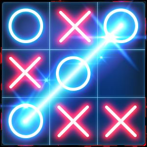
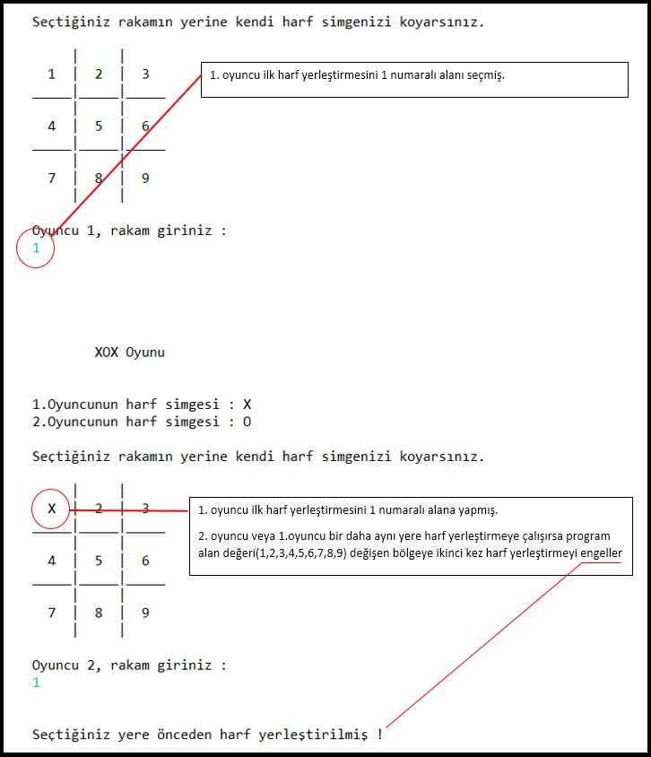
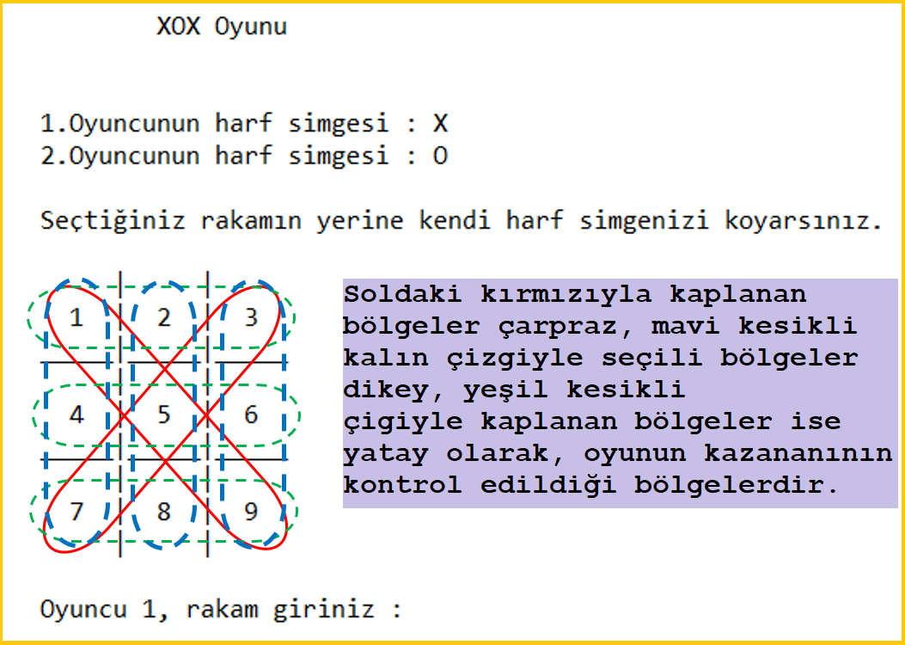

 
# A-Tic_Toc_Toe

Programda hamle sayısına göre tekrarlayan, konum seçtirme döngüsü vardır.
Bu döngü toplamda en fazla 9 kez çalışır.
Bu döngü sınır değerini de kontrol ederse 9 hamle yapılmış ve oyun berabere bitmiş olur.

Döngü işletilirken kazanan olursa bu döngü kırılır ve program sonlandırılır.

-----------------------------------------------------------------------------------------------------------------------------------------

Oyundayken her yeni durumda, tahtanın güncel halini yazan statik tahtaYazdir fonksiyonu vardır.

-----------------------------------------------------------------------------------------------------------------------------------------
Statik tahtaKontrol fonksiyonu harf yerleştirmenin yapılacağı zaman tahtaya harf yerleştirmeyi sağlar. 
Tahtada daha önceden bu konuma harf yerleştirilmişse, konumun dolu olduğunu bilgi olarak hamle isteme aşamasına gönderir.
 
-----------------------------------------------------------------------------------------------------------------------------------------
Her başarılı harf yerleştirmeden sonra, kazanan oyuncu olup olmadığı statik kazananKontrol fonksiyonu tarafından belli konumlar üzerinde kontrol edilir.

___________________________________________________________________________________________________________________________________
## Programda harf yerleştirme işlemi

___________________________________________________________________________________________________________________________________
## Programda kazanan kontrol işlemi

İletişim
------------------------------
https://recepkarademir.blogspot.com.tr

https://recepkarademir.wordpress.com

## BU PROJENİN KULLANILABİLİRLİK SEVİYESİ: 8/10
